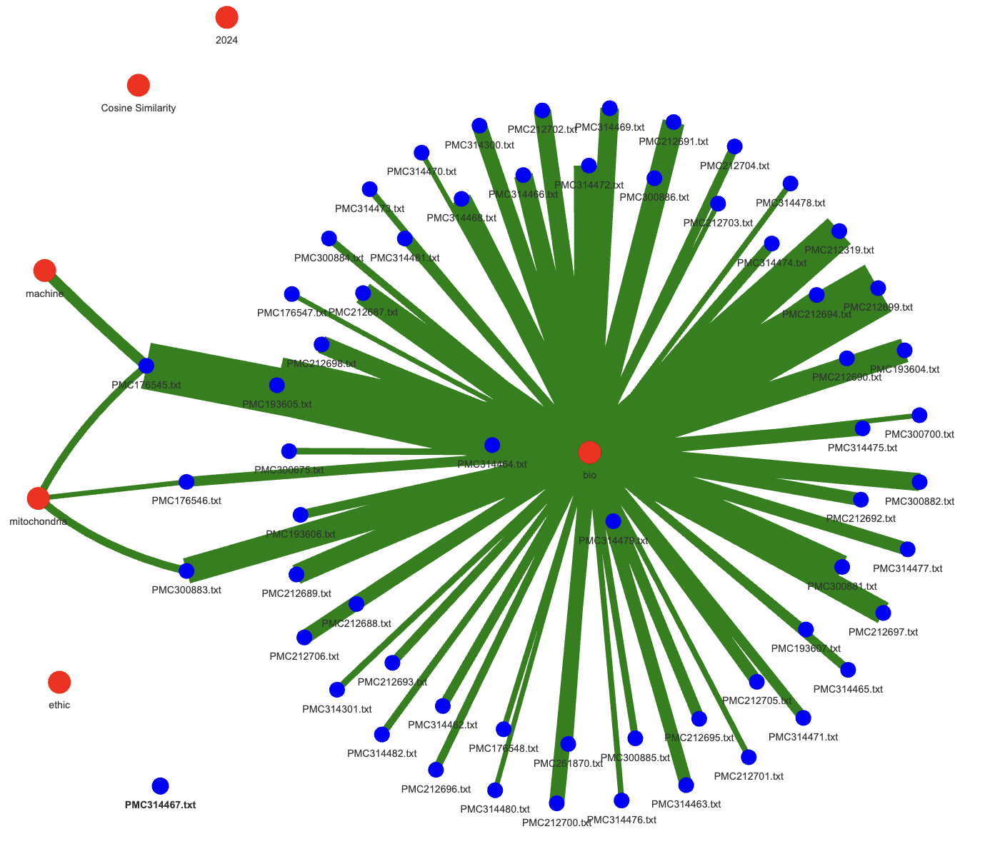

# BeagleTA: A Text Analysis Processing Pipeline for the analysis of relationships between documents based on word usage

- Oliver Bonham-Carter, [Web](https://www.oliverbonhamcarter.com/)
- email: obonhamcarter@allegheny.edu
- Date: 9th April 2025


## Table of Contents
- [BeagleTA: A Text Analysis Processing Pipeline for the analysis of relationships between documents based on word usage](#beagleta-a-text-analysis-processing-pipeline-for-the-analysis-of-relationships-between-documents-based-on-word-usage)
  - [Table of Contents](#table-of-contents)
  - [Overview](#overview)
  - [Setup: Rust, Python and Dependencies](#setup-rust-python-and-dependencies)
  - [BeagleTA: A Text Analysis Processing Pipeline](#beagleta-a-text-analysis-processing-pipeline)
  - [1\_beagleTA\_parser](#1_beagleta_parser)
    - [Purpose](#purpose)
    - [Flow](#flow)
    - [Usage](#usage)
    - [Example](#example)
  - [2\_csv\_cleaner\_filter](#2_csv_cleaner_filter)
    - [Purpose](#purpose-1)
    - [Flow](#flow-1)
    - [Usage](#usage-1)
    - [Example](#example-1)
  - [3\_csv\_random\_sampler](#3_csv_random_sampler)
    - [Purpose](#purpose-2)
    - [Flow](#flow-2)
    - [Usage](#usage-2)
    - [Examples](#examples)
  - [Corpus](#corpus)
  - [Setting up the Corpus](#setting-up-the-corpus)
  - [Citations](#citations)
  - [Developer Notes](#developer-notes)
  - [A Work In Progress](#a-work-in-progress)

## Overview

This project is a text analysis processing pipeline designed to analyze relationships between documents based on word usage. The pipeline consists of three main components: a parser, a CSV cleaner/filter, and a random sampler. Each component is implemented as a separate binary in Rust, allowing for efficient data processing and analysis.

To simplify the maintenance of the code, the project was designed to be modular, allowing users to easily complete each task of a text analysis in three stages: *parsing*, *cleaning*, and *sampling*. There are three bins in the project and each is responsible for a specific task. We note that each task may be executed independently or in sequence to complete an analysis  and get results. The modular design also allows for easy customization, enabling users to add new features or modify existing ones without affecting the entire pipeline.

The parser reads a list of keywords from a file and processes a directory of text files, extracting relevant data based on the keywords. The output is saved in a CSV file, which can then be cleaned and filtered using the CSV cleaner/filter binary. This binary removes unnecessary columns and rows based on user-defined parameters, resulting in a cleaned CSV file.
The random sampler binary randomly selects rows from the cleaned CSV file and generates one or more smaller CSV files. This is particularly useful for working with large datasets that are difficult to process or visualize in their entirety.
The pipeline is designed to be user-friendly, with clear usage instructions and examples provided for each binary. The command-line interface allows users to easily specify input and output files, as well as any additional parameters required for each task. This makes it easy to integrate the pipeline into existing workflows or to use it as a standalone tool for text analysis.

The pipeline is particularly useful for researchers and data scientists working with text data, as it provides a streamlined approach to processing and analyzing large datasets. The use of Rust for implementation ensures high performance and reliability, making it suitable for handling large-scale text analysis tasks.

## Setup: Rust, Python and Dependencies

Before running the binaries, ensure that you have Rust installed on your system. You can install Rust by following the instructions at the Rust website: [https://www.rust-lang.org/](https://www.rust-lang.org/), or by vising [rustßup](https://rustup.rs/). In addition, since the Parser step uses some Python code to generate visualizations, you will also need to install Python and some required dependencies. You can create a virtual environment and install the dependencies using pip by following the below commnds.

```bash
python3 -m venv ~/Desktop/venv
source ~/Desktop/venv/bin/activate
pip install plotly matplotlib numpy pandas networkx seaborn scikit-learn pyvis
```

## BeagleTA: A Text Analysis Processing Pipeline

This project consists of three main binaries (i.e., `bins`) that perform distinct tasks in a data processing pipeline, should the user require them. Below is an overview of each binary, its purpose, and how to use it.

---

## 1_beagleTA_parser

### Purpose

This binary is the main parser program. It processes a corpus of text files and extracts relevant data based on a set of keywords.

### Flow

1. Reads a list of keywords from a file (e.g., `kws.txt`).
2. Processes a directory of text files (e.g., `corpus_short/`).
3. Outputs the parsed data to a CSV file.

### Usage

```bash
cargo run --bin 1_beagleTA_parser -- <keywords_file> <corpus_directory>
```

### Example

```bash
cargo run --bin 1_beagleTA_parser -- examples/kws.txt examples/corpus_short/
```

When the program completes, the program will output the below summary. The results are saved to File, `0_out/output.csv`. 

``` text
Usage: cargo run <keyword_file.txt> <corpus_dir>
Found 64 files in the directory 'examples/corpus_short/'.
Key words : ["2024", "ethic", "bio", "machine", "mitochondria"]
```

After the parser executes, the printed output offers suggestions for generated  Python scripts to be used to create a wide variety of visuals from the data such as the heatmaps, keyword analysis and others. The scrips are automatically created in the script output directory, `0_out/0_out/`.

The suggested commands to run the Python scripts are the following.

``` bash
cd 0_out && python3 visualizations.py && cd ..
cd 0_out && python3 interactive_network_1.py --datafile output.csv --threshold 6 && cd .. 
cd 0_out && python3 interactive_network_2.py --datafile output.csv && cd .. 
cd 0_out && python3 complete_network.py -f output.csv -t 6  -nc blue -ec green  && cd .. 
```

The outputs from the Python scripts have a lot of overlap with each other and the user may decide which are most helpful for a particular task. The Python scripts are as follows.

+ `visualizations.py` outputs heatmaps in html documents to be displayed using a browser. The results are based on the data in the File `output.csv`.
+ `interactive_network_1.py` outputs networks of keywords connected to articles. The weight of the edge indicates the number of keyword occurrences in an article. The minimum number of keyword occurrences for articles may be toggled with the  `--threshold <integer>` parameter.
+ `interactive_network_2.py` outputs `network.html` which interactive network visualization using pyvis of keywords and connected articles.
+ `complete_network.py` outputs a network of keywords and articles. The weight of the edge indicates the number of keyword occurrences in an article. The minimum number of keyword occurrences for articles may be toggled with the  `-t <integer>` parameter. The color of the nodes may be toggled with the `-nc <color>` and `-ec <color>` parameters.
---


An examples of the output of the `complete_network.py` script. 

## 2_csv_cleaner_filter

### Purpose

This component is used to clean and filter the output CSV file generated by the parser. It allows users to remove noise such as unnecessary columns and rows based on specific criteria.

### Flow

1. Reads the input CSV file.
2. Removes specified columns and rows based on user-defined parameters.
3. Outputs the cleaned data to a new CSV file.
4. Generates a text file report of removed rows.


### Usage

```bash
cargo run --bin 2_csv_cleaner_filter -- --input <input_csv> --output <output_csv> --column <column_index> --remove-column <remove_column_index>
```

### Example

```bash
cargo run --bin 2_csv_cleaner_filter -- --input 0_out/output.csv --output 0_out/cut_output.csv --column 2 --remove-column 3
```

The above command checks for zeros in the second column and removes rows having zeros in this column. The above also removes the second column.  All results are saved to `0_out/cut_output.csv` and a report of the removed rows is saved to `removed_rows.txt`. The removed column is specified by its index (0-based).

An example of how the removal system works for a csv table in a file `simple.csv` is shown below. 

``` csv
AA,B,C,D
A1,1,0,1
A2,0,1,1
A3,1,0,1
A4,0,1,1
A5,1,0,0
A6,0,1,0
A7,1,0,0
A8,0,1,0
A9,1,0,0
```

``` bash
cargo run --bin 2_csv_cleaner_filter -- --input 0_out/simple.csv --output simple_out.csv --column 4
```

The above command is used to remove the rows where there are zeros in the fourth column (`C`). The output is saved to the file `simple_out.csv`, shown below.

``` csv
AA,B,C,D
A1,1,0,1
A2,0,1,1
A3,1,0,1
A4,0,1,1
```

The report, `removed_rows.txt`, contains the rows that were removed. The report is shown below.

``` text
A5 was removed: [1.0, 0.0, 0.0]
A6 was removed: [0.0, 1.0, 0.0]
A7 was removed: [1.0, 0.0, 0.0]
A8 was removed: [0.0, 1.0, 0.0]
A9 was removed: [1.0, 0.0, 0.0]
```

---

## 3_csv_random_sampler

### Purpose 


The Sampler tool is used to randomly sample a specified number of rows from a cleaned CSV file and generate one or more smaller CSV files. This ia also particularly useful for working with large datasets that are difficult to process or visualize in their entirety.

For instance, there are some types of analysis in which the trends are more interesting than the actual documents containing keywords. For instance, if the user wants to have a basic snapshot of the kinds of connections in the data, the Sampler tool could be used to pick a random selection of data to plot these types of results.

### Flow

1. Reads the cleaned CSV file.
2. Randomly selects a specified number of rows.
3. Outputs the sampled data to one or more CSV files.
4. User may supply output files to the Ppython scripts for plotting, or use a different plotting library altogether.

### Usage

```bash
cargo run --bin 3_csv_random_sampler -- --input <input_csv> --sample_size <number_of_rows> --output <output_prefix> --num_files <number_of_files>
```

### Examples

- Sample 5 rows and save to a single file in `0_out/`:

```bash
cargo run --bin 3_csv_random_sampler -- --input 0_out/output.csv --sample_size 5 --output sampler_output --num_files 1 
```

- Sample 10 rows and save random selections to ten files in `0_out/`:

```bash
cargo run --bin 3_csv_random_sampler -- --input 0_out/output.csv --sample_size 5 --output sampler_output --num_files 10
```

- Prepare a network from a user-selected CSV file and save network to `0_out/sampler_output_01.csv`:

``` bash
python3 interactive_network_2.py --datafile 0_out/sampler_output_01.csv --output_file sampler_output_01_plot
```

## Corpus

NCBI offers bulk downloads of literature in two types of packages: _commercial_ and _non-commercial_. Please see https://ftp.ncbi.nlm.nih.gov/pub/pmc/readme.txt for more information.

BeagleTM has been designed to work with the xml files which are found in the `*.tar.gz` files. These `tar.gz` files files may be found at the below online repositories.

- _Commercially_ available
  - https://ftp.ncbi.nlm.nih.gov/pub/pmc/oa_bulk/oa_comm/txt/

- _Non-Commercially_ available
  - https://ftp.ncbi.nlm.nih.gov/pub/pmc/oa_bulk/oa_noncomm/txt/
* _FTP_ site
  + ftp://ftp.ncbi.nlm.nih.gov/pub/pmc

## Setting up the Corpus

+ Make a directory to store your downloaded files such as `corpus/` and use your browser to download the `tar.gz` data files from one of the above links. 

If using Linux or MacOS, Another way to untar the files in bulk is by the following script. This script code can be placed into a file (`bulkUntar.sh`) and run using the command, `sh bulkUntar.sh` at the (Unix) terminal and will place the files into separate directories which must be placed into the `corpus/` directory.

``` bash
for x in `ls *.tar.gz`
  do
  	tar -vxf $x
  done
```

* Once these files have been downloaded, the `txt` files must be extracted (i.e., an untarring step). The command, `tar -zxvf filename.tar.gx` can handle this step. If there are several files, then wildcards may be used: `tar -zxvf *.tar.gz`.

## Citations

- Accepted at FLAIRS-38 (The Florida Artificial Intelligence Research Society).
- Formal reference to follow when available.

  - Bonham-Carter, Oliver. "An Efficient Text Analysis Tool for Streamlining Literature Reviews", Proceedings of FLAIRS-38
  
## Developer Notes

- Added dependency:
  - `crossbeam-channel = "0.5.15"` to upgrade from v0.5.11 which had dependabot issue ("crossbeam-channel Vulnerable to Double Free on Drop #1)

## A Work In Progress
Check back often to see the evolution of the project!! BeagleTA is a work-in-progress. Updates will come periodically.

If you would like to contribute to this project, then please do! For instance, if you see some low-hanging fruit or task that you could easily complete, that could add value to the project, then I would love to have your insight.

Otherwise, please create an Issue for bugs or errors. Since I am a teaching faculty member at Allegheny College, I may not have all the time necessary to quickly fix the bugs. I welcome the OpenSource Community to further the development of this project. Much thanks in advance.

If you appreciate this project, please consider clicking the project's Star button. :-)
